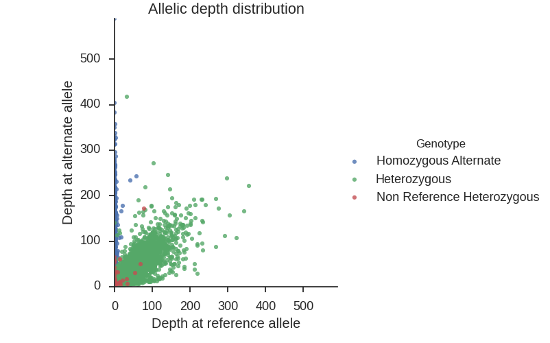

# Vcfstats
This is a vcf visualization tool. Visualizing allelic depth distribution.


##Prerequisites:
* [python (>=2.7)](https://www.python.org/downloads/)
* [seaborn](http://stanford.edu/~mwaskom/software/seaborn/index.html)
* [numpy](http://www.numpy.org/)
* [pandas](http://pandas.pydata.org/)
* [matplotlib](http://matplotlib.org/)


##Usage:
```python
vizualize_vcf.py [-h] [-i INPUT] [-o OUTPUT] [-s SAMPLES]

Vcf stats and visualization

optional arguments:
  -h, --help            show this help message and exit
  -i INPUT, --input INPUT
                        Input vcf file path
  -o OUTPUT, --output OUTPUT
                        Output directory path
  -s SAMPLES, --samples SAMPLES
                        Sample to be analyzed
```

##Example

